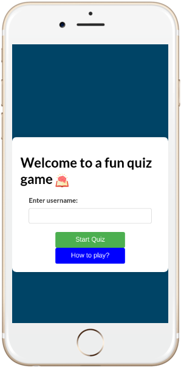
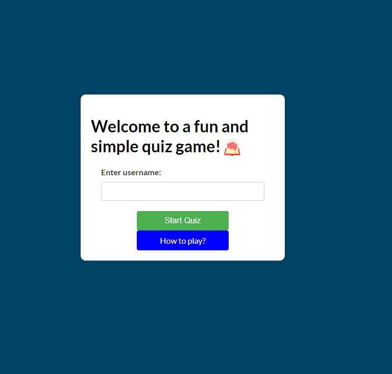
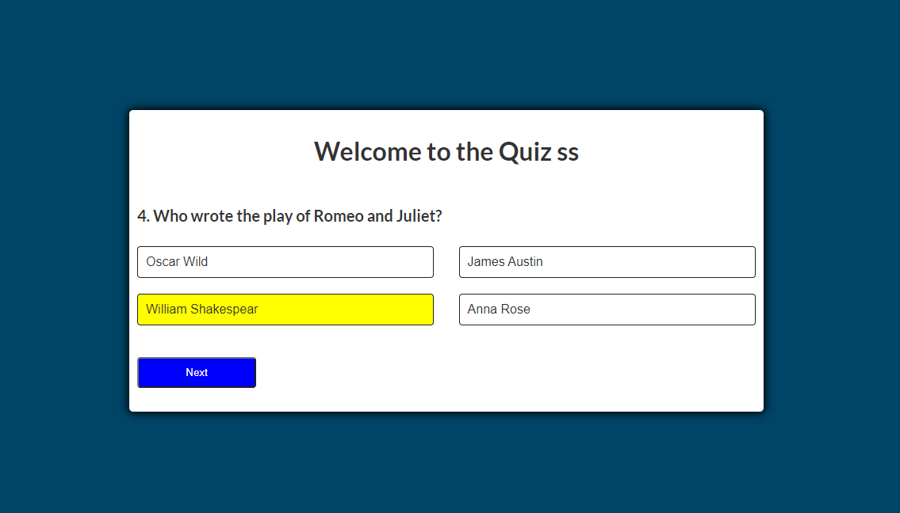
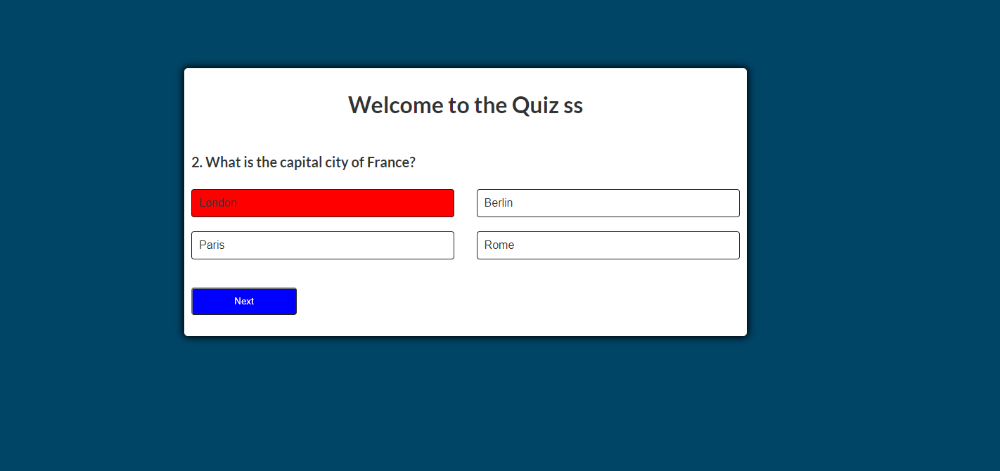
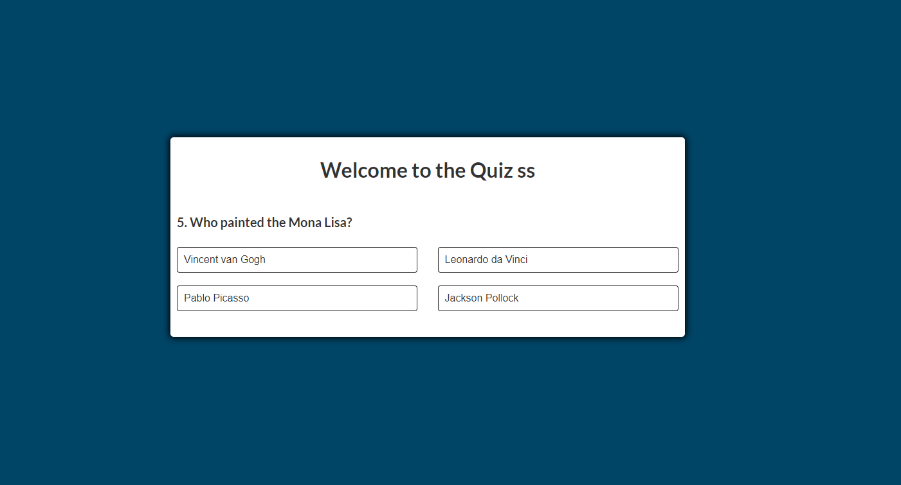
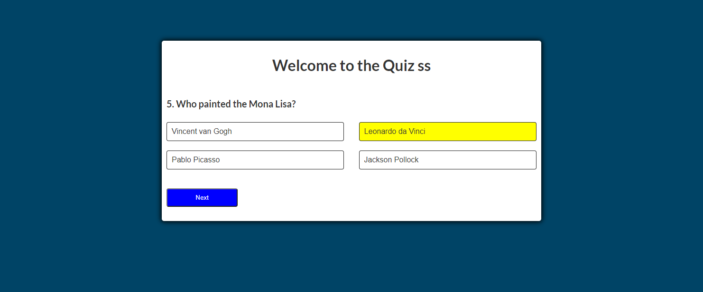
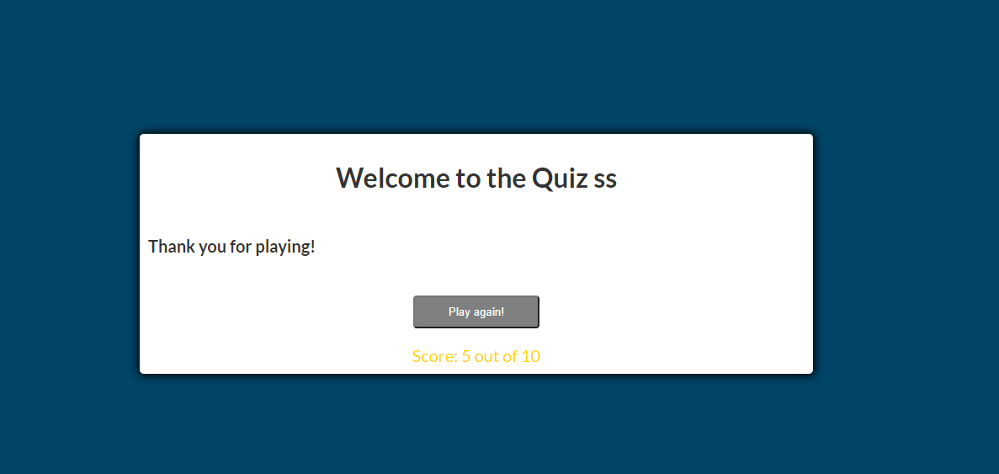
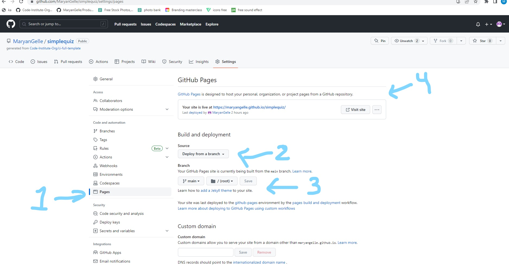

# General Knowledge Quiz

General Knowledge Quiz is a simple and beginner friendly game that aims to test general knowledge through multiple-choice questions. It is suitable for anyone, including adults and children.

We welcome you to your new favorite game website that will test your knowledge. Since this quiz is a beginer friendly, it will be a good start to challange yourself. We believe knowledge should be both fun and rewarding. The primary objective of the game is to assess the players general knowledge while also serving as a learning tool. You can access our platform through <a href="https://maryangelle.github.io/simplequiz/" target="_blank" rel="noopener">General Knowledge Quiz</a>

# Contents

* [**User Experience UX**] (<#user-experience-ux>)

- [Features](#features)
  - [Current Features](#current-features)
  - [Future Features](#future-features)
- [Testing](#testing)
- [Deployment](#deployment)
- [Credit](#credit)
- [Aknowledgment](#aknowledgment)
  

# User Experience UX

The quiz game allows the players to personlize their experience by entering a username.

By entering their own username, players will have a personlized game experience. This feature enhances users experience and creates an interactive that is both fun but also personal. One the user/player enters their name it will be displayed throughout the game. This provides a sense of ownership and connection. 

It also allows users the flexibility to express their individuality to their game experience. 

## Privacy

The player's username will only be visable to their players game session, this will not be stored or collected. It ensures privacy and secruity for all our users. The final page with scoring only includes the specific players score and does not display previous players name for security reasons. 

## Users Demands
* A user want to see instructions to the game on "how to play".
* A user want to know how long the game will take.
* A user want to know the level of difficulty this game required.
* A user want to know who the main target players are based on age.
* A user want to know how they scored.
  
[Back to top](#contents)

# Features

Below you will find the features used in my quiz game project. The value the features in my project and why its useful function for the quiz game. 

## Current Features

- ## Home-page
  * Welcoming users to the page and request to choose a username for the game. 
  * An icon for the quiz. To enhance user experience through visual appeal in order to add visual interest. It also serves the purpose to create a layout that is visually enganging. It creates a brand and recognition to lift up General Knowledge Quiz.
  *  Username Entry is required upon the players to set a unique username in order to personlise the game experience.
  * A button "how to play" that instructs the user with information about the game and how to play. It allows a better user experience sinze the players gain an understanding for the game mechanics. The users also get familiar with the rules and expectations.
  * A start button "start Quiz" creates a benefit to the users as a seamless invitation to click the button for an easy smooth transition to the game. It creates intuitive user interaction by pressing the button it creates a call-to-action to start the game. 

    

  * Button colors for "start quiz" and "how to play" have been picked out as vibrant button colors as they play significant role in enhancing user experience and adding value to the quiz game. The colors create an emotional respone to the users as they have the ability to evoke emotions. Green color creates emotions of "fresh" and "new" and thus was picked to make the users excited to try out the game. "Blue" was used for "how to play" button since blue color is conveys a trusting sence. We want our users to feel that they can trust our game and trust to find the information they need to successfully play the quiz. 

- ## Quiz Page
  
    * Answer Feedback colors has been created that is associated with the users choice of answer. It is interactive with the users input of choice. Distinct colors of "yellow" and "red" to provide feedback on the true or false answer. It provides clear visial differentiation for the users to identity their answers either as wrong or wright. The colors sends an immidiete feedback to the users and reinforces them to remember the correct and incorrect answers for future references. 

  * Next button's function only appears after the players have choicen and clicked an answer. It serves as a progression controll, it provides strucure and controlled game experience. It inceases users engagement as it also a form to make the users engaged and interactive in the game, pushing them to take action to procees the game's next question. It also serves to push the learning experience of the users as it allows the users to reflect their answer before moving to next question automatically. 
  
    Below you will find images of the same question before and after appearance of the "next button".
  

  * Sound effect for answer feedback has been integrated to create a sound effect for right and wrong answer. In order to enhance overall users experience. It serves as an audio feedback for the users to reflect their answers. Correct answer has a positive sound which create a sense of achievement and encouragement for our users. It serves as inclusive function for our users who perhaps need an audio feedback instead of a visual feedback. This promotes accessbility for all our users. 

- ## End Page 
 The end of the quiz game features several functions and component that contribute to  closure to the game and users final experience.  
  * A thank you text to thank the users for their engagement. It serves the purpose to make the users feel valued for their time and aknowledged for participating. 
  * A score text which allows users to see their final score for the game. It serves the purpose to motivate users to play again and if needed to score better next time. 
  * A play again button is created to offer users the ability to play again and restart the game. It encourages replaybility for users to play again and an opportunity for continued learning. 
  

## Future Features
Features for future quiz feature inorder to improve users overall experience that could be included to the quiz includes: 
 * Controll for sound effect. Ability for users to mute the sounds off if needed. 
 * A score board that is visable throughout the game to allows users to predict their final result. 
 * Different levels to the quiz game, were the users can pick from beginner friendly, mid and difficult level. This would attract more users to the game.

# Testing
Testing and validation was used to ensure quality and correct coding in order to create a functioning quiz for our users experience. 
  
- Html Validator: The HTML code has been validated using the [W3 Markip Validation Service] (<https://validator.w3.org/#validate_by_input>)
- JavaScript Validator: The JavaScript code has been validated using the [Esprima] (https://esprima.org/demo/validate.html)
- CSS Validator: The CSS code has been validated using the [W3 CSS Validation Service] (<https://jigsaw.w3.org/css-validator/>)

# Deployment
 The General Knowledge Quiz can be deployed using the steps:

1. In the repository of Github, go to setting.
2. On the setting page, on your left side tab you will click on Pages.
3. Once inside Github Pages, you will find "source" select main and click save.
4. You will then be able to see the github page, the green box will show up under suggesting that the side has been published at link toward your page. 

[Back to top](#contents)

# Credit

  Below you will find credit references to my sources for content and media. 

## Reference

- Lato Font from [Google Fonts] (https://www.fonts.googleapis.com/css2?family=Lato:ital,wght@0,100;0,300;0,400;0,700;1,100;1,300;1,400;1,700&display=swap)

* Sound Effect:
   Correct sound effect from [Pixabay] (<https://pixabay.com/sound-effects/search/correct/>)
 
  Wrong sound effect from [Pixabay] (<https://pixabay.com/sound-effects/search/incorrect/>)

- Icon from [Flaticon] (<https://www.flaticon.com/search?word=knowledge>)
  

[Back to top](#contents)

# Acknowledgment
* This Website quiz game was made by Maryan Gelle (Developer) as a Project 2 JavaScript for my Full Stack programe at Code Institue in 2023. 

[Back to top](#contents)